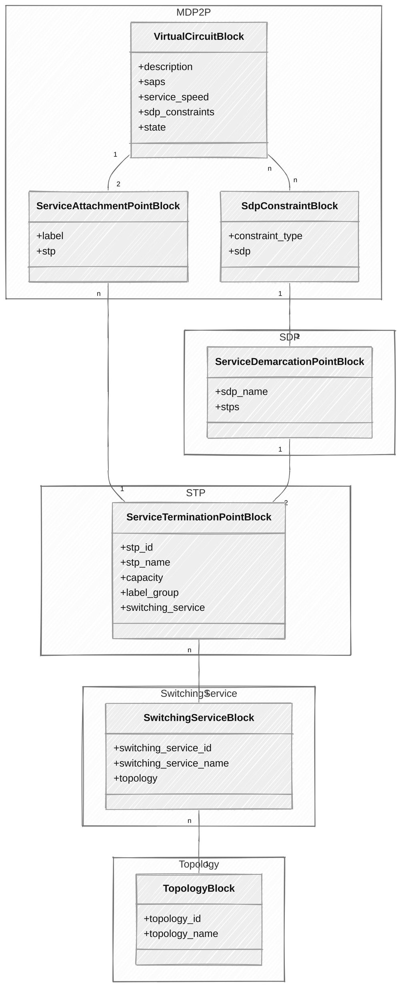

# nsi-orchestrator

The NSI orchestrator, based on the
[Workflow Orchestrator framework](https://github.com/workfloworchestrator/orchestrator-core),
maintains the lifecycle of network topologies, switching
services, Service Termination Points (STP), Service Demarcation Points (SDP),
and the Multi Domain Point-to-Point (MDP2P) services across a NSI
infrastructure, using the
[NSI DDS Proxy](https://github.com/workfloworchestrator/nsi-dds-proxy)
as source of information and the
[NSI Aggregator Proxy](https://github.com/workfloworchestrator/nsi-aggregator-proxy)
as its Network Resource Manager (NRM).

## Project ANA-GRAM

This software is being developed by the 
[Advanced North-Atlantic Consortium](https://www.anaeng.global/), 
a cooperation between National Education and Research Networks (NRENs) and 
research partners to provide network connectivity for research and education 
across the North-Atlantic, as part of the ANA-GRAM project. 

The goal of the ANA-GRAM project is to federate the ANA trans-Atlantic links through
[Network Service Interface (NSI)](https://ogf.org/documents/GFD.237.pdf)-based automation.
This will enable the automated provisioning of L2 circuits spanning different domains 
between research parties on other sides of the Atlantic. The ANA-GRAM project is 
spearheaded by the ANA Platform & Requirements Working Group, under guidance of the 
ANA Engineering and ANA Planning Groups.  

## Products and Product Blocks

```mermaid
%%{init: {"look": "handDrawn", "theme": "neutral"}}%%
classDiagram
    namespace MDP2P {
        class VirtualCircuitBlock {
            +description
            +saps
            +service_speed
            +sdp_constraints
            +state
        }
        class ServiceAttachmentPointBlock {
            +label
            +stp
        }
        class SdpConstraintBlock {
            +constraint_type
            +sdp
        }
    }
    namespace STP {
        class ServiceTerminationPointBlock {
            +stp_id
            +stp_name
            +capacity
            +label_group
            +switching_service
        }
    }
    namespace SDP {
        class ServiceDemarcationPointBlock {
            +sdp_name
            +stps
        }
    }
    namespace SwitchingService {
        class SwitchingServiceBlock {
            +switching_service_id
            +switching_service_name
            +topology
        }
    }
    namespace Topology {
        class TopologyBlock {
            +topology_id
            +topology_name
        }
    }

    VirtualCircuitBlock "1" -- "2" ServiceAttachmentPointBlock
    ServiceAttachmentPointBlock "n" -- "1" ServiceTerminationPointBlock
    ServiceTerminationPointBlock "n" -- "1" SwitchingServiceBlock
    SwitchingServiceBlock "n" -- "1" TopologyBlock
    VirtualCircuitBlock "n"  -- "n" SdpConstraintBlock
    SdpConstraintBlock "1"  -- "1" ServiceDemarcationPointBlock
    ServiceDemarcationPointBlock "1"  -- "2" ServiceTerminationPointBlock
```
