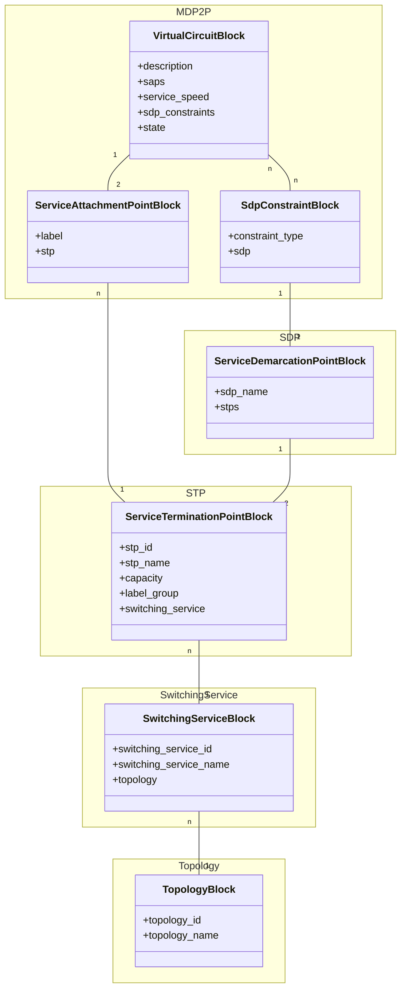

# nsi-orchestrator

The NSI orchestrator, based on the
[Workflow Orchestrator framework](https://github.com/workfloworchestrator/orchestrator-core),
maintains the lifecycle of network topologies, switching
services, Service Termination Points (STP), Service Demarcation Points (SDP),
and the Multi Domain Point-to-Point (MDP2P) services across a NSI
infrastructure, using the
[NSI DDS Proxy](https://github.com/workfloworchestrator/nsi-dds-proxy)
as source of information and the
[NSI Aggregator Proxy](https://github.com/workfloworchestrator/nsi-aggregator-proxy)
as its Network Resource Manager (NRM).

## Project ANA-GRAM

This software is being developed by the 
[Advanced North-Atlantic Consortium](https://www.anaeng.global/), 
a cooperation between National Education and Research Networks (NRENs) and 
research partners to provide network connectivity for research and education 
across the North-Atlantic, as part of the ANA-GRAM (ANA Global Resource Aggregation Method) project. 

The goal of the ANA-GRAM project is to federate the ANA trans-Atlantic links through
[Network Service Interface (NSI)](https://ogf.org/documents/GFD.237.pdf)-based automation.
This will enable the automated provisioning of L2 circuits spanning different domains 
between research parties on other sides of the Atlantic. The ANA-GRAM project is 
spearheaded by the ANA Platform & Requirements Working Group, under guidance of the 
ANA Engineering and ANA Planning Groups.  

    

## Architecture

The diagram below shows the ANA-GRAM automation stack and how the NSI Orchestrator fits into the broader architecture.

    

**Color legend:**

| Color | Meaning |
|-------|---------|
| Purple | Existing software deployed in every participating network |
| Green | Existing NSI infrastructure software |
| Orange | Software being developed as part of ANA-GRAM |
| Yellow | Future software to be developed as part of ANA-GRAM |

**Components:**

- [**ANA Frontend**](https://github.com/workfloworchestrator) — Future management portal that will provide a comprehensive overview of all configured services on the ANA infrastructure, including real-time operational status information. It will communicate with the NSI Orchestrator as its backend.
- [**NSI Orchestrator**](https://github.com/workfloworchestrator/nsi-orchestrator) (this repository) — Central orchestration layer that manages the lifecycle of topologies, switching services, STPs, SDPs, and multi-domain connections. It uses the DDS Proxy for topology visibility and the NSI Aggregator Proxy as its Network Resource Manager.
- [**DDS Proxy**](https://github.com/workfloworchestrator/nsi-dds-proxy) — Fetches NML topology documents from the upstream DDS, parses them, and exposes the data as a JSON REST API. The NSI Orchestrator uses this to discover and synchronize topologies, switching services, STPs, and SDPs.
- [**NSI Aggregator Proxy**](https://github.com/workfloworchestrator/nsi-aggregator-proxy) — Translates simple REST/JSON calls into NSI Connection Service v2 SOAP messages toward the NSI Aggregator, abstracting NSI protocol complexity behind a linear state machine. The NSI Orchestrator uses this as its Network Resource Manager to provision and manage multi-domain connections.
- [**DDS**](https://github.com/BandwidthOnDemand/nsi-dds) — The NSI Document Distribution Service, a distributed registry where networks publish and discover NML topology documents and NSA descriptions.
- [**PCE**](https://github.com/BandwidthOnDemand/nsi-pce) — The NSI Path Computation Element, which computes end-to-end paths across multiple network domains using topology information from the DDS.
- [**NSI Aggregator (Safnari)**](https://github.com/BandwidthOnDemand/nsi-safnari) — An NSI Connection Service v2.1 Aggregator that coordinates connection requests across multiple provider domains, using the PCE for path computation.
- [**SuPA**](https://github.com/workfloworchestrator/SuPA) — The SURF ultimate Provider Agent, an NSI Provider Agent that manages circuit reservation, creation, and removal within a single network domain. Uses gRPC instead of SOAP, and is always deployed together with [**PolyNSI**](https://github.com/workfloworchestrator/PolyNSI), a bidirectional SOAP-to-gRPC translation proxy.

## Products and Product Blocks

```mermaid
classDiagram
    namespace MDP2P {
        class VirtualCircuitBlock {
            +description
            +saps
            +service_speed
            +sdp_constraints
            +state
        }
        class ServiceAttachmentPointBlock {
            +label
            +stp
        }
        class SdpConstraintBlock {
            +constraint_type
            +sdp
        }
    }
    namespace STP {
        class ServiceTerminationPointBlock {
            +stp_id
            +stp_name
            +capacity
            +label_group
            +switching_service
        }
    }
    namespace SDP {
        class ServiceDemarcationPointBlock {
            +sdp_name
            +stps
        }
    }
    namespace SwitchingService {
        class SwitchingServiceBlock {
            +switching_service_id
            +switching_service_name
            +topology
        }
    }
    namespace Topology {
        class TopologyBlock {
            +topology_id
            +topology_name
        }
    }

    VirtualCircuitBlock "1" -- "2" ServiceAttachmentPointBlock
    ServiceAttachmentPointBlock "n" -- "1" ServiceTerminationPointBlock
    ServiceTerminationPointBlock "n" -- "1" SwitchingServiceBlock
    SwitchingServiceBlock "n" -- "1" TopologyBlock
    VirtualCircuitBlock "n"  -- "n" SdpConstraintBlock
    SdpConstraintBlock "1"  -- "1" ServiceDemarcationPointBlock
    ServiceDemarcationPointBlock "1"  -- "2" ServiceTerminationPointBlock
```
