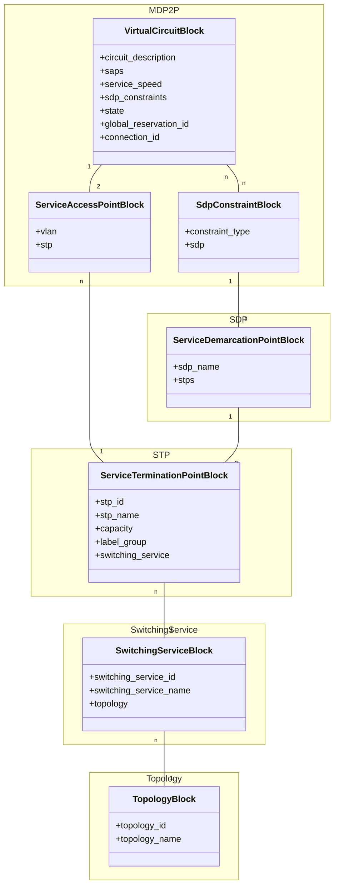

# nsi-orchestrator

The NSI orchestrator, based on the
[Workflow Orchestrator framework](https://github.com/workfloworchestrator/orchestrator-core),
maintains the lifecycle of network topologies, switching
services, Service Termination Points (STP), Service Demarcation Points (SDP),
and the Multi Domain Point-to-Point (MDP2P) services across a NSI
infrastructure, using the
[NSI DDS Proxy](https://github.com/workfloworchestrator/nsi-dds-proxy)
as source of information and the
[NSI Aggregator Proxy](https://github.com/workfloworchestrator/nsi-aggregator-proxy)
as its Network Resource Manager (NRM).

## Project ANA-GRAM

This software is being developed by the 
[Advanced North-Atlantic Consortium](https://www.anaeng.global/), 
a cooperation between National Education and Research Networks (NRENs) and 
research partners to provide network connectivity for research and education 
across the North-Atlantic, as part of the ANA-GRAM (ANA Global Resource Aggregation Method) project. 

The goal of the ANA-GRAM project is to federate the ANA trans-Atlantic links through
[Network Service Interface (NSI)](https://ogf.org/documents/GFD.237.pdf)-based automation.
This will enable the automated provisioning of L2 circuits spanning different domains 
between research parties on other sides of the Atlantic. The ANA-GRAM project is 
spearheaded by the ANA Platform & Requirements Working Group, under guidance of the 
ANA Engineering and ANA Planning Groups.  

    

## Architecture

The diagram below shows the ANA-GRAM automation stack and how the NSI Orchestrator fits into the broader architecture.

    

**Color legend:**

| Color | Meaning |
|-------|---------|
| Purple | Existing software deployed in every participating network |
| Green | Existing NSI infrastructure software |
| Orange | Software being developed as part of ANA-GRAM |
| Yellow | Future software to be developed as part of ANA-GRAM |

**Components:**

- [**ANA Frontend**](https://github.com/workfloworchestrator) — Future management portal that will provide a comprehensive overview of all configured services on the ANA infrastructure, including real-time operational status information. It will communicate with the NSI Orchestrator as its backend.
- [**NSI Orchestrator**](https://github.com/workfloworchestrator/nsi-orchestrator) (this repository) — Central orchestration layer that manages the lifecycle of topologies, switching services, STPs, SDPs, and multi-domain connections. It uses the DDS Proxy for topology visibility and the NSI Aggregator Proxy as its Network Resource Manager.
- [**DDS Proxy**](https://github.com/workfloworchestrator/nsi-dds-proxy) — Fetches NML topology documents from the upstream DDS, parses them, and exposes the data as a JSON REST API. The NSI Orchestrator uses this to discover and synchronize topologies, switching services, STPs, and SDPs.
- [**NSI Aggregator Proxy**](https://github.com/workfloworchestrator/nsi-aggregator-proxy) — Translates simple REST/JSON calls into NSI Connection Service v2 SOAP messages toward the NSI Aggregator, abstracting NSI protocol complexity behind a linear state machine. The NSI Orchestrator uses this as its Network Resource Manager to provision and manage multi-domain connections.
- [**DDS**](https://github.com/BandwidthOnDemand/nsi-dds) — The NSI Document Distribution Service, a distributed registry where networks publish and discover NML topology documents and NSA descriptions.
- [**PCE**](https://github.com/BandwidthOnDemand/nsi-pce) — The NSI Path Computation Element, which computes end-to-end paths across multiple network domains using topology information from the DDS.
- [**NSI Aggregator (Safnari)**](https://github.com/BandwidthOnDemand/nsi-safnari) — An NSI Connection Service v2.1 Aggregator that coordinates connection requests across multiple provider domains, using the PCE for path computation.
- [**SuPA**](https://github.com/workfloworchestrator/SuPA) — The SURF ultimate Provider Agent, an NSI Provider Agent that manages circuit reservation, creation, and removal within a single network domain. Uses gRPC instead of SOAP, and is always deployed together with [**PolyNSI**](https://github.com/workfloworchestrator/PolyNSI), a bidirectional SOAP-to-gRPC translation proxy.

## Products and Product Blocks

```mermaid
classDiagram
    namespace MDP2P {
        class VirtualCircuitBlock {
            +circuit_description
            +saps
            +service_speed
            +sdp_constraints
            +state
            +global_reservation_id
            +connection_id
        }
        class ServiceAccessPointBlock {
            +vlan
            +stp
        }
        class SdpConstraintBlock {
            +constraint_type
            +sdp
        }
    }
    namespace STP {
        class ServiceTerminationPointBlock {
            +stp_id
            +stp_name
            +capacity
            +label_group
            +switching_service
        }
    }
    namespace SDP {
        class ServiceDemarcationPointBlock {
            +sdp_name
            +stps
        }
    }
    namespace SwitchingService {
        class SwitchingServiceBlock {
            +switching_service_id
            +switching_service_name
            +topology
        }
    }
    namespace Topology {
        class TopologyBlock {
            +topology_id
            +topology_name
        }
    }

    VirtualCircuitBlock "1" -- "2" ServiceAccessPointBlock
    ServiceAccessPointBlock "n" -- "1" ServiceTerminationPointBlock
    ServiceTerminationPointBlock "n" -- "1" SwitchingServiceBlock
    SwitchingServiceBlock "n" -- "1" TopologyBlock
    VirtualCircuitBlock "n"  -- "n" SdpConstraintBlock
    SdpConstraintBlock "1"  -- "1" ServiceDemarcationPointBlock
    ServiceDemarcationPointBlock "1"  -- "2" ServiceTerminationPointBlock
```

The product blocks and their fields are defined in [`templates/`](templates), one YAML per product
(`topology`, `switchingservice`, `stp`, `sdp`, `mdp2p`). These are the configuration templates the
orchestrator-core generator reads (`python main.py generate product-blocks|product|workflows|migration
--config-file templates/<product>.yaml`); they describe the data model only — workflows, the connection
state machine, and the proxy services are hand-written on top.

## Topology product

The topology product tracks the NSI topologies discovered through the
[DDS Proxy](https://github.com/workfloworchestrator/nsi-dds-proxy). Each subscription represents a
single topology, identified by its `topology_id` and described by a `topology_name`. Four workflows
manage its lifecycle:

- **Create** — presents a dropdown of the topologies returned by the DDS Proxy `GET /topologies`
  endpoint that do not yet have a subscription, and initialises `topology_name` from the name the
  topology operator set in the DDS.
- **Modify** — change the `topology_name` (`topology_id` is read-only).
- **Validate** — assert the subscription's `topology_id` is still advertised by the DDS Proxy.
- **Terminate** — remove the subscription. The DDS is the authoritative, read-only source of
  topologies, so nothing is deprovisioned in an external system.

## Multi domain point-to-point product

The multi domain point-to-point (MDP2P) product represents a connection reserved through the
[NSI Aggregator Proxy](https://github.com/workfloworchestrator/nsi-aggregator-proxy). A subscription
holds a `VirtualCircuit` block with two `ServiceAccessPoint`s (each a subscribed STP plus a VLAN
carried as the SAP `vlan`), an optional list of `SdpConstraint`s (SDPs to include or exclude from
the path), the requested `service_speed`, the orchestrator-generated `global_reservation_id`, the
aggregator-assigned `connection_id`, and the reservation `state`.

The reservation `state` is driven by a small [python-statemachine](https://pypi.org/project/python-statemachine/)
connection state machine (`CREATED → RESERVED → ACTIVATED`, with `terminate` to `TERMINATED` and any
step able to end in `FAILED`). The aggregator owns the detailed NSI lifecycle and rejects illegal
operations itself; this state machine is the orchestrator's local view, persisted on the block. The
reserve, provision, release and terminate operations are asynchronous: each fires a request and the
aggregator POSTs the result back to a `callback_step`.

- **Create** — form for a description, source/destination STP and VLAN, the service speed, and SDPs
  to include/exclude. Each STP option is labelled with its still-free VLANs (its DDS range minus the
  VLANs the aggregator reports in use), and STPs already part of an SDP are gated behind a checkbox;
  each VLAN is validated against its STP (within range and not already in use). Reserves the
  connection via `POST /reservations` with a freshly generated global reservation id; the state ends
  up `RESERVED` or `FAILED`.
- **Provision** — `RESERVED → ACTIVATED` via `POST /reservations/{connectionId}/provision`.
- **Release** — `ACTIVATED → RESERVED` via `POST /reservations/{connectionId}/release`.
- **Modify** — edit the local virtual circuit `circuit_description` (not pushed to the aggregator).
- **Validate** — assert the connection's stored capacity, STPs, VLANs, global reservation id and
  state still match `GET /reservations/{connectionId}`.
- **Terminate** — `RESERVED` or `FAILED` → `TERMINATED` via `DELETE /reservations/{connectionId}`.
- **Reconcile** — re-read `GET /reservations/{connectionId}` and, if `state` drifted from the
  aggregator's stable state (e.g. a callback was missed after a network problem), update it;
  transient states (RESERVING/ACTIVATING/DEACTIVATING) are left for a later run.

SDP include/exclude constraints are stored on the subscription but are not yet sent to the
aggregator, which has no path-constraint field.

## Configuration

Configuration is read from environment variables.

| Variable | Default | Description |
|---|---|---|
| `DATABASE_URI` | _orchestrator-core default_ | PostgreSQL connection string for the orchestrator database. |
| `TRANSLATIONS_DIR` | `translations` _(set by the app)_ | Directory of project translation files (workflow names and form-field labels) served at `/api/translations/{lang}`. |
| `DDS_PROXY_BASE_URL` | `http://localhost:8080` | Base URL of the nsi-dds-proxy REST API. |
| `DDS_PROXY_TIMEOUT_SECONDS` | `30.0` | HTTP timeout for DDS Proxy requests. |
| `DDS_PROXY_MTLS_ENABLED` | `false` | Authenticate to the DDS Proxy with mutual TLS. Enable in deployments. |
| `DDS_PROXY_CLIENT_CERT` | _(unset)_ | Path to the PEM client certificate (used when mTLS is enabled). |
| `DDS_PROXY_CLIENT_KEY` | _(unset)_ | Path to the PEM private key (used when mTLS is enabled). |
| `DDS_PROXY_CA_BUNDLE` | _(unset)_ | Path to a CA bundle used to verify the DDS Proxy server (used when mTLS is enabled). |
| `DDS_PROXY_AUTH_METHOD` | `x509` | Local-dev only: value of the `X-Auth-Method` header sent when mTLS is disabled. |
| `DDS_PROXY_CLIENT_DN` | `CN=...` | Local-dev only: value of the `X-Client-DN` header sent when mTLS is disabled. |

When `DDS_PROXY_MTLS_ENABLED` is `false`, the orchestrator authenticates to the DDS Proxy by
sending the `X-Auth-Method` / `X-Client-DN` identity headers it trusts at its edge — a development
shortcut only. In a deployment, enable mTLS and configure the certificate, key, and CA bundle.

The Aggregator Proxy is configured the same way, with `AGGREGATOR_PROXY_*` variables that mirror the
`DDS_PROXY_*` ones above (`AGGREGATOR_PROXY_BASE_URL`, `AGGREGATOR_PROXY_TIMEOUT_SECONDS`,
`AGGREGATOR_PROXY_MTLS_ENABLED`, `AGGREGATOR_PROXY_CLIENT_CERT`, `AGGREGATOR_PROXY_CLIENT_KEY`,
`AGGREGATOR_PROXY_CA_BUNDLE`, `AGGREGATOR_PROXY_AUTH_METHOD`, `AGGREGATOR_PROXY_CLIENT_DN`). In
addition:

| Variable | Default | Description |
|---|---|---|
| `REQUESTER_NSA` | `urn:ogf:network:example.net:2026:nsa:nsi-orchestrator` | NSA URN this orchestrator presents as the requester. |
| `PROVIDER_NSA` | `urn:ogf:network:example.net:2026:nsa:safnari` | NSA URN of the target aggregator; must match the Aggregator Proxy's configured provider NSA. |
| `ORCHESTRATOR_CALLBACK_BASE_URL` | `http://localhost:8080` | This orchestrator's externally reachable base URL; the Aggregator Proxy POSTs reservation results to `<base>/api/processes/{id}/callback/{token}`. Override in every deployment. |

### Default customer

This orchestrator has no CRM, so subscriptions are created against orchestrator-core's
built-in default customer (the create forms do not ask for one). Its identity is configured through
the standard orchestrator-core environment variables — no application-specific settings are needed:

| Variable | Default | Description |
|---|---|---|
| `DEFAULT_CUSTOMER_IDENTIFIER` | `59289a57-70fb-4ff5-9c93-10fe67b12434` | UUID stored as each subscription's customer id. |
| `DEFAULT_CUSTOMER_FULLNAME` | `Default::Orchestrator-Core Customer` | Display name shown for the customer. |
| `DEFAULT_CUSTOMER_SHORTCODE` | `default-cust` | Short code shown for the customer. |
