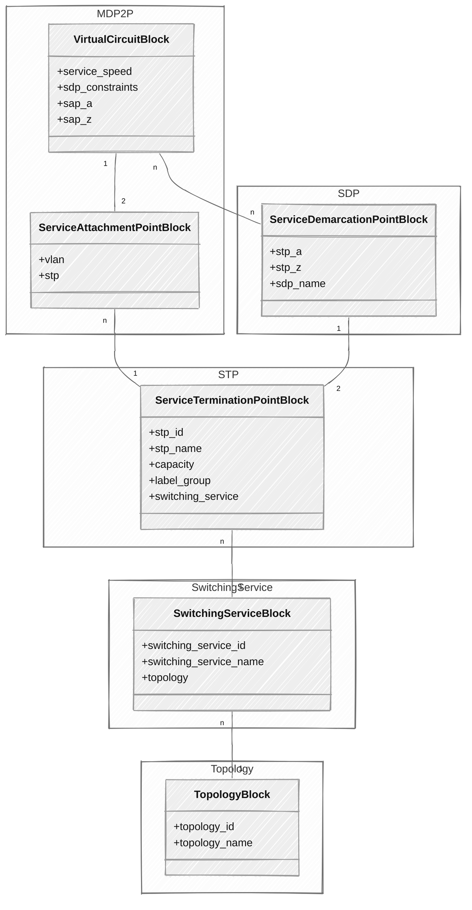

# nsi-orchestrator

The NSI orchestrator maintains the lifecycle of network topologies, switching
services, Service Termination Points (STP), Service Demarcation Points (SDP),
and the Multi Domain Point-to-Point (MDP2P) services across a NSI
infrastructure, using the
[NSI DDS Proxy](https://github.com/workfloworchestrator/nsi-dds-proxy)
as source of information and the
[NSI Aggregator Proxy](https://github.com/workfloworchestrator/nsi-aggregator-proxy)
as its Network Resource Manager (NRM).

## Products and Product Blocks

